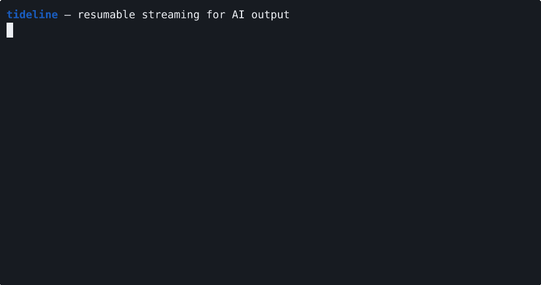

# Tideline

[](https://github.com/dylanp12/tideline/actions/workflows/ci.yml)

**Reliable streaming for AI output.** Tideline is a tiny, self-hostable server that streams LLM/agent output to any number of clients — and handles the parts that break at scale: resume after disconnect, fan-out to many viewers, replay for late joiners, and slow-client isolation. Open source, written in Rust.

> Status: early but hardened — SSE, single binary, with auth, lifecycle reaping, limits, and Prometheus metrics. Runs in-memory by default, or **Redis-backed for horizontal scale** across many instances.



*A real capture: tokens stream live over SSE, the connection drops mid-answer at offset 4, and a reconnect with `Last-Event-ID` resumes exactly — no gap, no repeat.*

## Why

Every app shipping AI features streams tokens to users. At real scale it breaks in predictable ways:

- a network blip drops half a long answer, with no clean resume;
- you can't cheaply stream **one** generation to **many** viewers;
- a slow client stalls everyone;
- someone opening the link late can't catch up.

Raw SSE and low-level platform primitives (Cloudflare Durable Objects, API Gateway WebSockets) give you a pipe — you build resume, fan-out, replay, and backpressure yourself. The hosted real-time vendors (Pusher, Ably, PubNub) are generic and priced punishingly per connection. Tideline does exactly one thing: make AI output streaming reliable.

## Quickstart

```bash
cargo run   # listens on :8080
```

```bash
# your backend publishes chunks as the model generates
curl -XPOST localhost:8080/streams/demo --data 'Hello '
curl -XPOST localhost:8080/streams/demo --data 'world'
curl -XPOST localhost:8080/streams/demo/complete

# any client reads the whole stream over SSE
curl -N localhost:8080/streams/demo
# id: 0
# data: Hello
#
# id: 1
# data: world
#
# event: done

# reconnect and resume — Last-Event-ID skips what you already saw
curl -N -H 'Last-Event-ID: 0' localhost:8080/streams/demo
# id: 1
# data: world
# event: done
```

Because it's SSE with the offset in each `id:` field, browsers resume automatically on reconnect — no client code required.

**In React** — resumable streaming in a few lines (the zero-dependency client lives in [`sdk/`](sdk/); copy it into your app or vendor the two files):

```jsx
import { useStream } from "./sdk/react.js";

function Answer({ id }) {
  const { text, status, reconnects } = useStream("http://localhost:8080", id);
  // status: connecting | streaming | reconnecting | done | error
  return <p data-status={status}>{text}</p>;
}
```

## The five hard parts

- **Resumable** — reconnect with `Last-Event-ID` and resume exactly where you left off; no lost or duplicated tokens.
- **Fan-out** — one generation, many subscribers. Publish once, deliver to N.
- **Replay / late-join** — join mid-stream or after; get the buffered history, then live.
- **Slow-client isolation** — a slow consumer can't stall the generation or other clients.
- **Dead-simple** — `POST` tokens in, read SSE out. JS/TS SDK + a React `useStream` hook included.

## How it compares

|                                   | raw SSE     | Durable Objects | Pusher/Ably | **Tideline** |
| --------------------------------- | ----------- | --------------- | ----------- | --------- |
| resume after disconnect           | build it    | build it        | partial     | ✓         |
| fan-out one→many                  | ✗           | build it        | ✓           | ✓         |
| replay / late-join                | ✗           | build it        | partial     | ✓         |
| self-host, no per-connection bill | ✓           | platform        | ✗           | ✓         |
| AI-streaming-shaped               | ✗           | ✗               | ✗           | ✓         |

## Benchmarks

One generation fanned out to many concurrent SSE clients — single core, in-process, **100% delivery**:

| subscribers | tokens | events delivered | time   | throughput  |
| ----------- | ------ | ---------------- | ------ | ----------- |
| 1,000       | 100    | 100,000          | 0.10 s | ~950k ev/s  |
| 5,000       | 100    | 500,000          | 0.96 s | ~520k ev/s  |
| 10,000      | 50     | 500,000          | 1.17 s | ~430k ev/s  |

Reproduce: `cargo run --release --example loadtest -- 10000 50` (loopback on one box — treat it as a floor, not a cloud number).

## Production

Tideline is built to be exposed, not just demoed:

- **Auth** — set `TIDELINE_PUBLISH_TOKEN` to require `Authorization: Bearer <token>` on all writes (publish / complete / error / delete). Optionally set `TIDELINE_SUBSCRIBE_TOKEN` to gate reads too, or `TIDELINE_AUTH_URL` to have your own backend verify producer keys (answers are cached). Unset = open (dev mode), with a startup warning.
- **Private streams** — mark a stream private with `?private=1`; reads then require a short-lived, HMAC-signed ticket, so it isn't readable by anyone who guesses the id. Enforced across instances on the Redis backend.
- **Lifecycle** — a background reaper evicts idle streams (default 30 min) and completed streams (default 5 min), with LRU eviction past a `max_streams` cap, so the registry never grows unbounded. `DELETE /streams/:id` removes one explicitly.
- **Limits** — bounded per-stream replay buffer, 256 KB max publish body, validated stream IDs, and a max-subscribers-per-stream cap.
- **Observability** — `GET /metrics` (Prometheus): active streams, subscribers, buffered tokens, publishes, gaps, reaped.
- **Horizontal scale** — set `TIDELINE_REDIS_URL` to run many stateless instances behind a load balancer, sharing streams through Redis (see below).

### Subscribe tickets

For browsers reading private streams, mint a ticket server-side and put it in the URL — no cookies, no CORS gymnastics (CORS is permissive by design):

```
ticket = base64url(payload) + "." + base64url(HMAC-SHA256(secret, base64url(payload)))
payload = {"ns":"","sid":"<stream id>","exp":<unix seconds>}
```

signed with `TIDELINE_AUTH_SECRET`, then:

```
GET /streams/:id?from=0&ticket=<ticket>
```

A tampered or expired ticket is a 401.

### API

| Method & path | Purpose |
| --- | --- |
| `POST /streams/:id` | append a token (body = chunk) → returns the offset |
| `POST /streams/:id/complete` | finish the stream successfully |
| `POST /streams/:id/error` | terminate with an error (body = message) |
| `DELETE /streams/:id` | drop the stream |
| `GET /streams/:id` | subscribe over SSE (`Last-Event-ID` or `?from=` to resume) |
| `GET /streams/:id/ws` | subscribe over WebSocket (`?from=` to resume, `?token=` to auth) |
| `GET /metrics` | Prometheus metrics |
| `GET /health` | liveness |

SSE event types: default message (a token, carrying its `id:` offset), `gap`, `stream_error`, `done`.

### Transports

Tideline serves the same stream over either transport:

- **SSE** (default) — browsers auto-resume via `Last-Event-ID`, no client code. Ideal for one-way token streaming.
- **WebSocket** (`/streams/:id/ws`) — one bidirectional, binary-capable socket; JSON frames `{ "type": "token" | "gap" | "error" | "done", … }`. For non-browser clients, or when you want a single socket you can also write to.

Both are thin encoders over one internal signal stream, so adding a WebTransport / HTTP-3 transport later is additive, not a rewrite. Reach for SSE unless you specifically need a bidirectional or non-browser/binary client.

### Scaling out

By default Tideline runs as a single in-memory instance. Set `TIDELINE_REDIS_URL` and it becomes a **fleet of stateless instances sharing one Redis** — publish to any instance, subscribe from any other, and resume / replay / fan-out still hold:

```bash
TIDELINE_REDIS_URL=redis://my-redis:6379 cargo run
```

Each stream is a Redis Stream (an append-only, MAXLEN-trimmed log); offsets are assigned atomically with a Lua script, subscribers replay with `XRANGE` and tail live with a blocking `XREAD`, so the resume seam stays exact across processes — no lost or duplicated token, no sticky sessions. Redis TTLs handle lifecycle, so no reaper runs. Verified end-to-end by cross-instance tests (publish on one backend, subscribe on another sharing the same Redis).

## Deploy

```bash
# Docker
docker build -t tideline . && docker run -p 8080:8080 tideline

# Fly.io — edit the app name in fly.toml first (names are global)
fly launch --copy-config --no-deploy && fly deploy
```

## Status & roadmap

MVP engine: SSE, single binary, fully tested — fans out to 10k+ concurrent clients (see Benchmarks), with auth, lifecycle/TTL reaping, resource limits, and Prometheus metrics. Runs in-memory or **Redis-backed for horizontal scale** (the multi-instance unlock — shipped, cross-instance tested). SSE **and WebSocket** transports, a JS/TS + React SDK (`useStream` with reconnect tracking, plus a `subscribeWs` WebSocket client), and a Docker/Fly deploy path. Next: WebTransport / HTTP-3 (additive).

## Who's behind this

Tideline is built and maintained by **[Paraph](https://paraphhq.vercel.app)** — it's the real-time spine under Paraph's live human-oversight control room for AI agents. It's released as a standalone engine because resumable streams are useful far beyond that product. Issues and PRs welcome.

License: [MIT](LICENSE).
